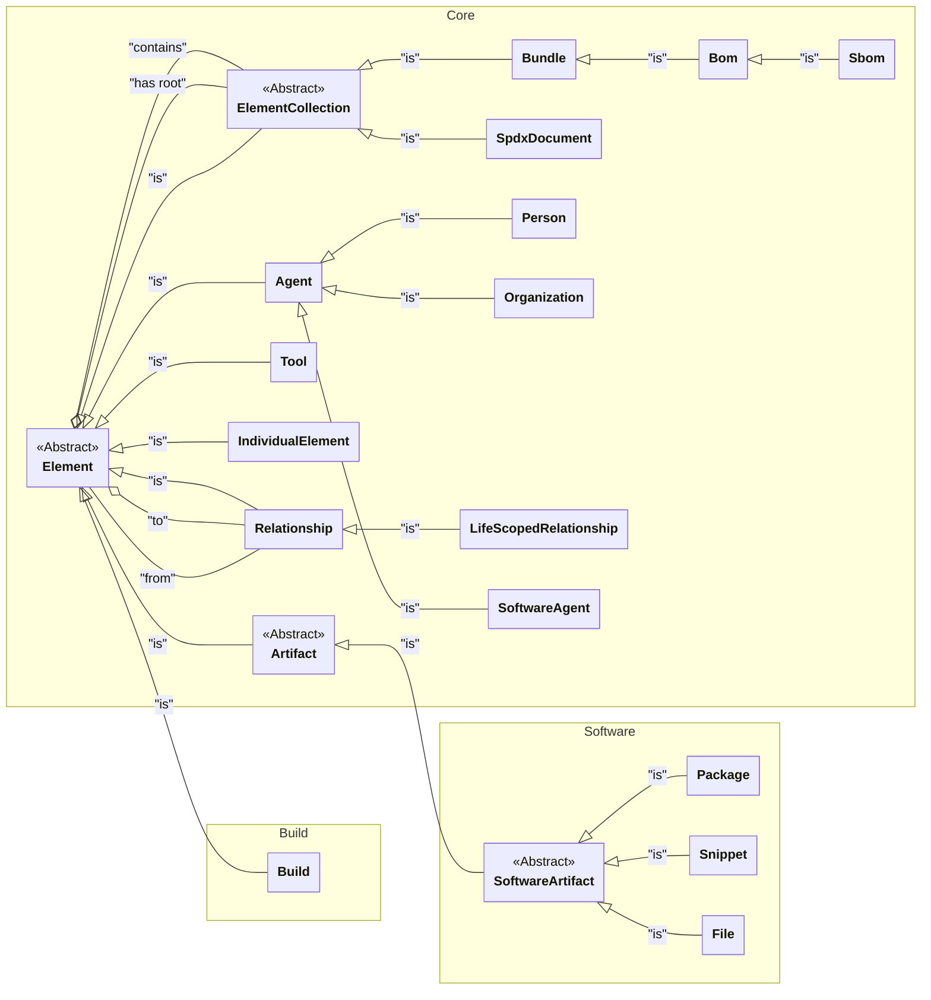

# Spdx3

A NuGet library (.NET 8) for creating, reading, and
writing [Software Bills of Materials](https://www.ntia.gov/page/software-bill-materials) files
in [SPDX 3](https://spdx.github.io/spdx-spec/v3.0.1/) format.

---

# Installation
Install like you would any other NuGet package.

# Catalogs and SpdxDocuments
The Spdx3 package uses a "Catalog" which contains all the various elements and 
objects in the document.  Every object you create is added to the Catalog (in fact,
the Catalog you're adding to is a parameter to the constructor for each object). Thus,
the Catalog is an object that relates very closely to the SpdxDocument, but is part
of the Spdx3 library implementation and not part of the Spdx 3 model.

SBOM's are one particular type of object in the Catalog - and is one of the most central
in the Catalog - but it's by no means the main one, and not even where you start.

The following is a *simplified* class diagram of some of the objects you're likely to 
work with -- ALL of which will be kept in the Catalog:

